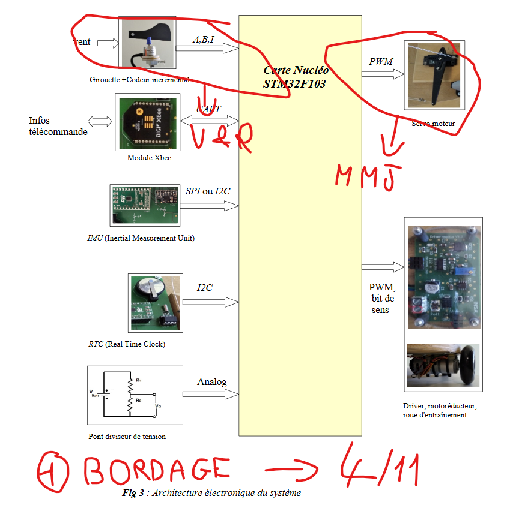

# projet-info-periph

GROUPE (╯°□°)╯︵ ┻━┻    
   

# Membres 

Jean VAN INGHELANDT 

Matthias RIFFARD 

Malik SEDIRA 

Robin SIMON

Valentin GUERBETTE

# Pins utilisées 

PA4 | A2 -> Index (Encoder) 

PA0 et PA1 | A0 et A1 -> A et B (Encoder)

PA6 | D12 -> Servo PWM

PB6 | D10 -> Plateau PWM

PB5 | D4 -> Plateau Dir.

PA10 | D2 -> UART RX

# Timers utilisés

TIM2_CH1 et TIM2_CH2 -> A et B (Encoder)

TIM3_CH1 -> Servo PWM

TIM4_CH1 -> Plateau PWM
